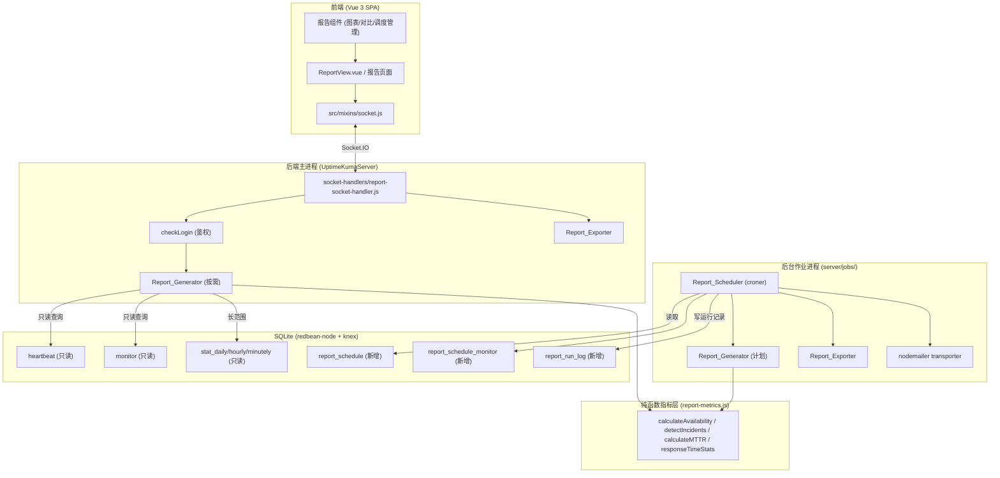
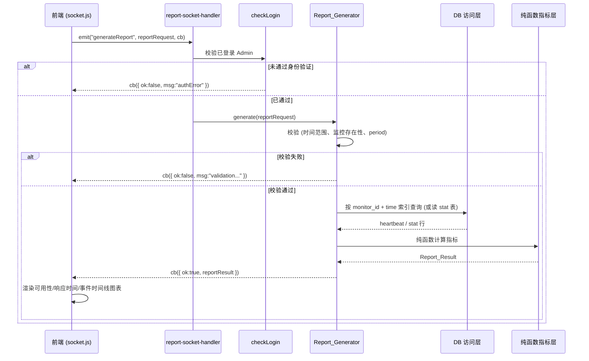
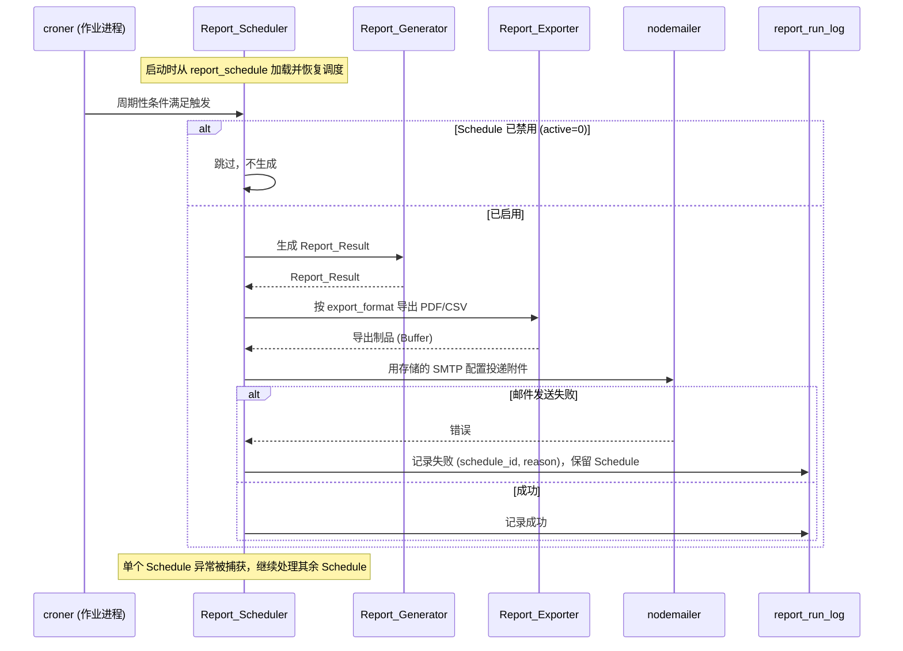

# 设计文档

## Overview

SLA_Report_Module 为 Uptime Kuma v2 增加了一套面向 Admin 的可用性报告能力：按需生成报告、可视化展示、PDF/CSV 导出、计划调度与邮件投递，以及多监控项对比。模块完全复用现有架构——通过 Socket.IO 通道通信、以 redbean-node 映射对象模型、用 croner 在独立后台作业进程中调度——并以"只读 Heartbeat、只新增表、失败隔离"为核心约束，确保报告功能在任何情况下都不会干扰正在进行的监控检测。

设计遵循以下原则：

- **只读现有数据**：Report_Generator 只查询 `heartbeat`、`monitor` 以及预聚合的 `stat_daily` / `stat_hourly` / `stat_minutely` 表，绝不写入或修改这些表。
- **只新增表**：所有持久化需求通过 `db/knex_migrations/` 中仅含 `createTable` 的迁移满足，不改动现有 `heartbeat` / `monitor` 表结构（需求 9.3、9.4）。
- **纯函数指标层**：报告指标计算被拆分为不含 I/O 的纯函数层（可做属性测试）与一个薄薄的 DB 访问层，二者解耦。
- **失败隔离**：报告生成、导出、调度的任何异常都被捕获并以可据以行动的错误返回，绝不冒泡影响监控、通知、状态页或维护窗口（需求 10）。
- **复用既有机制**：Socket.IO 鉴权（`checkLogin`）、i18n（`src/lang/en.json`）、SMTP 通知配置、Vue 3 组件模式均直接复用。

### 关键设计决策与理由

| 决策 | 理由 | 相关需求 |
| --- | --- | --- |
| 指标计算拆分为纯函数层 + DB 访问层 | 纯函数层可对任意输入做属性测试，无需数据库；DB 访问层只负责取数 | 2、7 |
| 新增 `pdfkit` 作为后端运行时依赖 | 现有依赖无纯 JS 的 PDF 生成能力；`pdfkit` 为纯 JS，可在后端进程内生成 PDF 流 | 4.1 |
| Report_Scheduler 直接用存储的 SMTP 通知配置构建 nodemailer transporter | 现有 `Notification.send` 不支持附件，而报告需将 PDF/CSV 作为邮件附件投递 | 5.3 |
| 调度运行在 `server/jobs/` 的独立作业进程 | 与监控检测进程隔离，重型查询/渲染不阻塞主进程的检测与 Socket.IO 事件处理 | 5.6、7.2 |
| 跨度 > 2 天（172800 秒）优先使用预聚合 stat 表 | 避免对 10 万级 Heartbeat 全表扫描，配合需求 7.1「10 万行 10 秒内返回」的硬指标 | 7.1、7.4 |
| 缺失数据用 `null` 而非 `0` 表达 | `0%` 与"无数据"语义不同，避免误导 SLA 判断 | 2.7 |

## Architecture

### 组件分层



### 按需报告数据流（On-demand）



### 计划报告数据流（Scheduled）



### Socket.IO 事件契约

所有事件均在 handler 入口通过 `checkLogin(socket)` 强制要求已通过身份验证的 Admin；未通过则在回调中返回鉴权错误且不执行任何逻辑（需求 8.2、8.3）。回调统一采用 Uptime Kuma 既有的 `{ ok: boolean, msg?: string, ... }` 形态。

| 事件名 | 入参 | 回调返回 | 鉴权 | 相关需求 |
| --- | --- | --- | --- | --- |
| `generateReport` | `reportRequest` | `{ ok, reportResult \| msg }` | checkLogin | 1、2、6、8.1 |
| `exportReport` | `{ reportRequest, format }` | `{ ok, fileName, base64 \| msg }` | checkLogin | 4 |
| `getReportSchedules` | — | `{ ok, schedules }` | checkLogin | 5.1 |
| `getReportSchedule` | `scheduleId` | `{ ok, schedule }` | checkLogin | 5.1 |
| `addReportSchedule` | `schedule` | `{ ok, scheduleId \| msg }` | checkLogin | 5.1、5.2、5.7、9.1 |
| `editReportSchedule` | `scheduleId, schedule` | `{ ok, msg }` | checkLogin | 5.1、5.7 |
| `deleteReportSchedule` | `scheduleId` | `{ ok, msg }` | checkLogin | 5.1 |
| `getReportRunLogs` | `scheduleId` | `{ ok, logs }` | checkLogin | 5.4 |

### 需求到设计的可追溯性

| 需求 | 设计落点 |
| --- | --- |
| 1 为时间范围生成报告 | `report-socket-handler.generateReport` → Report_Generator；`resolveTimeRange()` 推导/校验 Time_Range |
| 2 计算可用性指标 | 纯函数指标层 `report-metrics.js`（可用性、在线/离线时长、事件数、MTTR、响应时间、两位小数、缺失数据为 null） |
| 3 可视化 | 前端 `ReportCharts.vue` 等，复用 chart.js + vue-chartjs；事件时间线空状态 |
| 4 导出 | Report_Exporter（pdfkit + CSV UTF-8），含时间范围与生成时刻，错误隔离 |
| 5 计划与邮件 | Report_Scheduler（croner，作业进程）+ nodemailer SMTP；失败记录与保留；禁用处理 |
| 6 多监控对比 | reportRequest 接受多个 monitorId；指标层逐监控计算；前端对比视图；导出含全部监控 |
| 7 大数据集性能 | 索引查询（monitor_id + time）、预聚合 stat 表、作业进程隔离 |
| 8 通信与访问控制 | `server/server.js` socket handler 注册区调用 `reportSocketHandler(socket)`（与 maintenance/general 等并列）；Socket.IO 事件契约 + `checkLogin` |
| 9 持久化配置 | `report_schedule` 等新增表；createTable-only 迁移；`server/jobs.js` 的 `initBackgroundJobs()` 调用 `loadAndSchedule()` 启动恢复 |
| 10 保留功能与错误处理 | 全链路 try/catch + 失败隔离；不修改监控/通知/状态页/维护行为 |
| 11 国际化 | 所有用户可见文本以键定义于 `src/lang/en.json`，复用既有 i18n |

## Components and Interfaces

### 后端文件布局

```
server/
  report/
    report-generator.js     # Report_Generator: 校验 + DB 访问层 + 编排
    report-metrics.js       # 纯函数指标层 (无 I/O, 可属性测试)
    report-data-access.js   # DB 访问层 (只读查询 heartbeat / stat)
    report-exporter.js      # Report_Exporter: pdfkit / CSV
    report-scheduler.js     # Report_Scheduler: croner + nodemailer 编排
  socket-handlers/
    report-socket-handler.js
  model/
    report_schedule.js      # redbean-node 模型 (可选, 配合 R.dispense)
db/knex_migrations/
  2025-XX-XX-0000-create-report-schedule.js
src/
  pages/
    ReportView.vue          # 报告生成与展示主页面
    ReportSchedules.vue     # 计划管理页面
  components/
    report/
      ReportConfigForm.vue      # Report_Request 配置表单
      AvailabilityChart.vue     # 可用性图表
      ResponseTimeChart.vue     # 响应时间趋势图
      IncidentTimeline.vue      # 事件时间线 (含空状态)
      MonitorComparisonTable.vue# 多监控对比视图
      ReportScheduleForm.vue    # Schedule 创建/编辑表单
```

**Socket handler 接线位置**：`reportSocketHandler(socket)` 在 `server/server.js` 的 socket handler 注册区被调用，与 `maintenanceSocketHandler`、`generalSocketHandler` 等既有 handler 并列注册（而非在 `server/uptime-kuma-server.js` 内注册）。

### Report_Generator（编排 + DB 访问）

职责：校验 Report_Request、解析 Time_Range、选择数据源（原始 heartbeat 或预聚合 stat）、调用纯函数指标层、汇总为 Report_Result。

```javascript
/**
 * Resolve a concrete Time_Range from a Report_Request.
 * For daily/weekly/monthly, derive from periodType + referenceDate.
 * For custom, use the explicit start/end.
 * @param {object} request The Report_Request.
 * @returns {{start: number, end: number}} Unix-second bounds.
 * @throws {ValidationError} If the range is invalid (start > end) or custom bounds missing.
 */
function resolveTimeRange(request) { /* ... */ }

/**
 * Generate a Report_Result for one or more monitors.
 * @param {object} request The validated Report_Request.
 * @returns {Promise<object>} The Report_Result.
 */
async function generate(request) { /* validate -> fetch -> compute -> assemble */ }
```

`generate` 现按 `shouldUseAggregatedStats(timeRange)`（跨度 > 2 天）选择数据源——长范围调用 `computeFromAggregatedStats`（读取预聚合 stat 表，由 `selectStatTable`/`getStatBucketSeconds` 决定粒度与桶时长），短范围调用 `computeFromRawHeartbeats`（原始 heartbeat，精确事件边界）。

校验顺序（需求 1.5、1.6、6.1）：

1. `periodType` 属于 `daily|weekly|monthly|custom`，否则验证错误。
2. `custom` 必须含显式 `start`/`end`（需求 1.3）；其他 period 用 `referenceDate` 推导（需求 1.4）。
3. `start > end` → 验证错误（需求 1.5）。
4. 每个 `monitorId` 必须存在于 `monitor` 表，否则返回指明缺失标识符的验证错误（需求 1.6）。
5. 至少一个 `monitorId`；支持多个（需求 6.1）。

### 纯函数指标层（report-metrics.js）

无任何数据库或网络依赖，输入为已取出的 Heartbeat（或 stat 聚合）数组与 Time_Range，输出为指标对象。这是属性测试的核心目标。

```javascript
/**
 * Compute availability percentage over a time range, excluding MAINTENANCE time.
 * up / (up + down); MAINTENANCE intervals are removed from the denominator.
 * @param {Array<object>} beats Heartbeat-like records sorted by time ascending.
 * @param {{start:number,end:number}} range The Time_Range.
 * @returns {number|null} Percentage rounded to 2 decimals, or null when no data.
 */
function calculateAvailability(beats, range) { /* ... */ }

/**
 * Detect incidents: maximal continuous DOWN (status=0) intervals.
 * @param {Array<object>} beats Heartbeat records sorted by time ascending.
 * @returns {Array<{start:number, end:number|null, duration:number|null}>} Incidents.
 */
function detectIncidents(beats) { /* ... */ }

/**
 * Mean Time To Recovery: average duration of resolved incidents.
 * @param {Array<object>} incidents Incidents from detectIncidents.
 * @returns {number|null} Average duration in seconds, or null when none resolved.
 */
function calculateMTTR(incidents) { /* ... */ }

/**
 * Min / max / average response time over UP/PENDING beats with a ping value.
 * @param {Array<object>} beats Heartbeat records.
 * @returns {{min:number|null, max:number|null, avg:number|null}} Stats.
 */
function calculateResponseTimeStats(beats) { /* ... */ }

/**
 * Format a numeric percentage to a fixed 2-decimal representation.
 * @param {number|null} value The raw percentage.
 * @returns {string|null} e.g. "99.95", or null when input is null.
 */
function formatPercentage(value) { /* ... */ }
```

状态常量（复用现有定义）：`0=DOWN`、`1=UP`、`2=PENDING`、`3=MAINTENANCE`。可用性分母排除 `MAINTENANCE` 区间，使 `up/(up+down)` 不含维护时间（需求 2.2）。

### DB 访问层（report-data-access.js）

只读查询，所有查询以 `monitor_id` + 时间下界/上界为条件，命中索引（需求 7.3）。长时间范围优先读取预聚合 stat 表（需求 7.4）。

```javascript
/**
 * Fetch raw heartbeats for a monitor within a time range, using indexed columns.
 * @param {number} monitorId The monitor id.
 * @param {{start:number,end:number}} range The Time_Range.
 * @returns {Promise<Array<object>>} Heartbeat rows ordered by time ascending.
 */
async function fetchHeartbeats(monitorId, range) { /* SELECT ... WHERE monitor_id=? AND time BETWEEN ? AND ? */ }

/**
 * Fetch pre-aggregated stats for long ranges (stat_daily/hourly/minutely).
 * @param {number} monitorId The monitor id.
 * @param {{start:number,end:number}} range The Time_Range.
 * @returns {Promise<Array<object>>} Aggregated stat rows.
 */
async function fetchAggregatedStats(monitorId, range) { /* ... */ }
```

数据源选择策略：当 Time_Range 跨度 **> 2 天（172800 秒）** 且存在预聚合统计时（即 `shouldUseAggregatedStats` 的阈值），使用 stat 表计算可用性/响应时间汇总；并在 stat 表内部进一步按跨度选择粒度——跨度 **> 90 天** 用 `stat_daily`、**> 7 天** 用 `stat_hourly`、否则用 `stat_minutely`。短范围（**≤ 2 天**）或需要精确事件边界时使用原始 heartbeat。该阈值配合需求 7.1「10 万行 10 秒内返回」的硬指标，避免对大表全表扫描。聚合路径下，可用性由 `sum(up)/(sum(up)+sum(down))` 计算，响应时间取各 up>0 桶的 ping_min/ping_max 与按 up 加权的平均 ping；uptime/downtime 按 up/down 比例对范围时长做估算；事件按桶粒度近似检测（连续 down>0 的桶合并为一段近似 Incident）。精确事件边界仍由短范围原始 heartbeat 路径提供。

### Report_Exporter（report-exporter.js）

```javascript
/**
 * Render a Report_Result to a PDF buffer using pdfkit.
 * Includes time range, generation instant, availability metrics, charts, incidents.
 * @param {object} reportResult The Report_Result.
 * @returns {Promise<{fileName:string, buffer:Buffer}>} The PDF artifact.
 */
async function exportPdf(reportResult) { /* ... */ }

/**
 * Render a Report_Result to a UTF-8 CSV buffer.
 * Includes per-monitor availability metrics and incident records.
 * @param {object} reportResult The Report_Result.
 * @returns {Promise<{fileName:string, buffer:Buffer}>} The CSV artifact (UTF-8).
 */
async function exportCsv(reportResult) { /* ... */ }
```

要点：每个制品都嵌入 Time_Range 与生成时刻（需求 4.3）；CSV 以 UTF-8 编码并写入 BOM 以兼容表格软件（需求 4.5）；导出失败抛出指明格式的错误且被上层捕获，不影响监控（需求 4.4、10）；多监控报告导出包含 reportRequest 指定的每个监控（需求 6.4）。

### Report_Scheduler（report-scheduler.js，作业进程）

```javascript
/**
 * Load persisted schedules and (re)register croner jobs on startup.
 * @returns {Promise<void>} Resolves once all active schedules are scheduled.
 */
async function loadAndSchedule() { /* read report_schedule -> new Cron(...) */ }

/**
 * Execute a single schedule: generate, export, deliver, log.
 * Skips disabled schedules; isolates failures per schedule.
 * @param {object} schedule The persisted schedule.
 * @returns {Promise<void>} Always resolves; failures are logged, not thrown.
 */
async function runSchedule(schedule) { /* ... */ }
```

要点：使用 `croner` 解析 `cron_expression`（需求 5.3）；运行在 `server/jobs/` 进程，不阻塞监控（需求 5.6、7.2）；用存储的 SMTP 通知配置自行构建 nodemailer transporter 以支持附件（需求 5.3）；`active=0` 时跳过（需求 5.5）；邮件失败记录到 `report_run_log` 并保留 Schedule（需求 5.4）；单个 Schedule 异常被捕获，继续处理其余（需求 10.2）；启动时从持久化配置恢复（需求 9.2）。`loadAndSchedule()` 在 `server/jobs.js` 的 `initBackgroundJobs()` 中被调用以在启动时恢复持久化计划，并用 try/catch 隔离其失败，以免影响其他后台作业的初始化。

### 前端组件

- `ReportConfigForm.vue`：选择监控（多选）、Period_Type、自定义起止、导出格式；提交 `generateReport`。
- `AvailabilityChart.vue` / `ResponseTimeChart.vue`：基于 chart.js + vue-chartjs 渲染（需求 3.1、3.2、3.5）。
- `IncidentTimeline.vue`：渲染每个事件的起止与时长；无事件时展示空状态提示而非空图表（需求 3.3、3.4）。
- `MonitorComparisonTable.vue`：多监控对比，所有监控共享同一 Time_Range（需求 6.3）。
- `ReportSchedules.vue` + `ReportScheduleForm.vue`：Schedule 的增删改查、运行日志查看；保存启用邮件的 Schedule 但无 SMTP 配置时展示验证错误（需求 5.7）。
- **导航入口**：报告功能入口位于 `src/layouts/Layout.vue` 的下拉菜单中（与 Maintenance、Settings 并列），包含两个 router-link——「SLA Report」（指向 `/report`）与「Report Schedules」（指向 `/report-schedules`）；所用 FontAwesome 图标（如 `chart-bar`、`clock`）需在 `src/icon.js` 注册。这是需求 3/5 可用性的前提，否则用户无法进入功能。
- 路由注册于 `src/router.js`；socket 调用统一经 `src/mixins/socket.js`；所有文本走 i18n 键（需求 11）。

## Data Models

通过单个 `createTable`-only 迁移新增三张表，不改动 `heartbeat` / `monitor`（需求 9.3、9.4）。列名 snake_case。

### report_schedule

| 列 | 类型 | 说明 |
| --- | --- | --- |
| `id` | increments PK | 主键 |
| `name` | string(255) notNullable | 计划名称 |
| `cron_expression` | string(255) notNullable | croner 周期性规则 |
| `period_type` | string(20) notNullable | `daily`/`weekly`/`monthly`/`custom` |
| `export_format` | string(10) notNullable | `pdf`/`csv` |
| `recipients` | text notNullable | 收件人列表（JSON 字符串） |
| `smtp_notification_id` | integer nullable | 引用现有 SMTP 通知配置的 id |
| `active` | boolean notNullable default true | 是否启用 |
| `created_date` | datetime | 创建时刻 |
| `updated_date` | datetime | 更新时刻 |

> **`cron_expression` 与 `period_type` 的关系**：二者相互独立，不应混淆。
> - `cron_expression` 决定「何时触发」一次计划报告（调度时机，由 croner 解析）。
> - `period_type` 决定「报告覆盖的时间范围」（`daily`/`weekly`/`monthly`/`custom`），由生成器从触发时刻的 referenceDate 推导。
>
> 例如「每天 cron 触发但生成『过去一周』的报告」是合法组合：cron 控制触发频率，period_type 控制报告窗口。

### report_schedule_monitor（计划-监控成员关系，多对多）

| 列 | 类型 | 说明 |
| --- | --- | --- |
| `id` | increments PK | 主键 |
| `schedule_id` | integer notNullable index → report_schedule.id | 所属计划 |
| `monitor_id` | integer notNullable index | 引用现有 monitor.id（仅读引用，不加外键约束以避免触碰现有表迁移耦合） |

### report_run_log（运行日志）

| 列 | 类型 | 说明 |
| --- | --- | --- |
| `id` | increments PK | 主键 |
| `schedule_id` | integer notNullable index → report_schedule.id | 所属计划 |
| `status` | string(20) notNullable | `success`/`failed` |
| `message` | text nullable | 失败原因（成功时为 null） |
| `run_time` | datetime notNullable | 运行时刻 |

迁移示例（仅展示结构，实际放入 `db/knex_migrations/`）：

```javascript
exports.up = function (knex) {
    return knex.schema
        .createTable("report_schedule", function (table) {
            table.increments("id");
            table.string("name", 255).notNullable();
            table.string("cron_expression", 255).notNullable();
            table.string("period_type", 20).notNullable();
            table.string("export_format", 10).notNullable();
            table.text("recipients").notNullable();
            table.integer("smtp_notification_id").unsigned().nullable();
            table.boolean("active").notNullable().defaultTo(true);
            table.datetime("created_date").nullable();
            table.datetime("updated_date").nullable();
        })
        .createTable("report_schedule_monitor", function (table) {
            table.increments("id");
            table.integer("schedule_id").unsigned().notNullable().index();
            table.integer("monitor_id").unsigned().notNullable().index();
        })
        .createTable("report_run_log", function (table) {
            table.increments("id");
            table.integer("schedule_id").unsigned().notNullable().index();
            table.string("status", 20).notNullable();
            table.text("message").nullable();
            table.datetime("run_time").notNullable();
        });
};

exports.down = function (knex) {
    return knex.schema
        .dropTableIfExists("report_run_log")
        .dropTableIfExists("report_schedule_monitor")
        .dropTableIfExists("report_schedule");
};
```

### 领域对象（运行时，非持久化表）

**Report_Request**

```javascript
{
    monitorIds: number[],          // 一个或多个监控 (需求 6.1)
    periodType: "daily"|"weekly"|"monthly"|"custom",
    referenceDate?: number,        // daily/weekly/monthly 的参考日期 (Unix 秒)
    start?: number,                // custom 必填
    end?: number                   // custom 必填
}
```

**Report_Result**

```javascript
{
    timeRange: { start: number, end: number },
    generatedAt: number,           // 生成时刻
    monitors: [
        {
            monitorId: number,
            availabilityPercentage: string|null,   // "99.95" 或 null (无数据)
            uptimeSeconds: number|null,
            downtimeSeconds: number|null,
            incidentCount: number|null,
            mttrSeconds: number|null,
            responseTime: { min: number|null, max: number|null, avg: number|null },
            incidents: [ { start: number, end: number|null, duration: number|null } ],
            availabilityTimeSeries: [ { time: number, availability: number|null } ],   // 按桶可用性序列（图表用）
            responseTimeSeries: [ { time: number, min: number|null, avg: number|null, max: number|null } ]
        }
    ]
}
```

## Correctness Properties

*属性（Property）是指在系统的所有有效执行中都应当成立的特征或行为——本质上是关于系统应当做什么的形式化陈述。属性是连接人类可读规格说明与机器可验证正确性保证之间的桥梁。*

下列属性源自验收标准的 prework 分析（已去重合并）。每条属性均为全称量化陈述，并标注其所验证的需求。它们覆盖纯函数指标层、请求校验、导出序列化、持久化往返、调度与访问控制规则——这些都是适合属性测试的部分。UI 渲染、性能基准、外部 SMTP 投递、迁移机制与 i18n 约定不在属性测试范围内（改用快照/示例/集成/基准/代码审查，见测试策略）。

### Property 1: 请求校验规则

*对任意* Report_Request：若其 `start > end`，或 `periodType` 为 `custom` 但缺失 `start`/`end`，或其引用了任一不存在于 monitor 集合中的 `monitorId`，则校验 SHALL 拒绝该请求并返回验证错误；当缺失监控时，错误消息 SHALL 指明缺失的标识符。

**Validates: Requirements 1.3, 1.5, 1.6**

### Property 2: Time_Range 推导不变式

*对任意* 参考日期与 `daily`/`weekly`/`monthly` 中的任一 Period_Type，`resolveTimeRange` 推导出的范围 SHALL 满足 `start <= end`，且其跨度符合该 Period_Type 的不变式（`daily` 覆盖一个自然日、`weekly` 跨度为 7 天、`monthly` 覆盖参考日期所在月份的整月）。

**Validates: Requirements 1.4**

### Property 3: 可用性计算正确性

*对任意* Heartbeat 序列与 Time_Range：当序列中存在非维护的受监控数据时，`calculateAvailability` SHALL 返回一个落在 `[0, 100]` 内的数值；向序列中加入任意数量的 `MAINTENANCE` 心跳 SHALL NOT 改变其结果（维护时间被排除在分母之外）；当序列中无任何受监控数据时，结果 SHALL 为 `null` 而非 `0`，且事件与响应时间指标 SHALL 被置为表示缺失的值（`null`）。

**Validates: Requirements 2.1, 2.2, 2.7**

### Property 4: 在线与离线时长守恒

*对任意* Heartbeat 序列与 Time_Range，计算得到的总在线时长与总离线时长之和 SHALL 等于该范围内非维护的受监控总时长（在浮点容差范围内）。

**Validates: Requirements 2.3**

### Property 5: 事件检测正确性

*对任意* Heartbeat 序列，`detectIncidents` 返回的每个 Incident SHALL 是一段极大的连续 `DOWN` 区间（其紧邻的前后心跳均不为 `DOWN`），且 `incidentCount` SHALL 等于所检测到的 Incident 数量。

**Validates: Requirements 2.4**

### Property 6: MTTR 等于已解决事件的平均时长

*对任意* Incident 列表，`calculateMTTR` SHALL 返回所有已解决（具有结束时刻）Incident 持续时长的算术平均值（在容差范围内）；当不存在任何已解决的 Incident 时，结果 SHALL 为 `null`。

**Validates: Requirements 2.5**

### Property 7: 响应时间统计量有序且取自样本

*对任意* 含响应时间的 Heartbeat 序列，`calculateResponseTimeStats` 返回的 `min`、`avg`、`max` SHALL 满足 `min <= avg <= max`，且 `min` 与 `max` SHALL 属于样本集合；当无任何响应时间样本时，三者 SHALL 均为 `null`。

**Validates: Requirements 2.6**

### Property 8: 可用性百分比保留两位小数

*对任意* 非空数值，`formatPercentage` 的输出 SHALL 是恰好保留两位小数的表示（匹配 `^\d+\.\d{2}$`）；输入为 `null` 时输出 SHALL 为 `null`。

**Validates: Requirements 2.8**

### Property 9: CSV 导出完整性与 UTF-8 往返

*对任意* Report_Result，所生成的 CSV 制品 SHALL 以 UTF-8 编码，并在以 UTF-8 解析后包含：Report_Request 中指定的每一个 Monitor 的可用性指标与 Incident 记录、该报告的 Time_Range 以及生成时刻；其中任意 Unicode 文本 SHALL 在往返后被原样保留。

**Validates: Requirements 4.2, 4.3, 4.5, 6.4**

### Property 10: Schedule 持久化往返

*对任意* 合法的 Schedule，将其保存到数据库后再加载，得到的 Schedule SHALL 与原始 Schedule 等价（周期性规则、监控标识符集合、Period_Type、收件人与导出格式均保持一致）。

**Validates: Requirements 5.2, 9.1**

### Property 11: 禁用的 Schedule 不生成报告

*对任意* 处于禁用状态（`active=false`）的 Schedule，`runSchedule` SHALL 跳过该 Schedule，且 SHALL NOT 触发报告生成或邮件投递。

**Validates: Requirements 5.5**

### Property 12: 无 SMTP 配置时拒绝启用邮件的 Schedule

*对任意* 启用了邮件投递但在系统中不存在任何已配置 SMTP_Channel 的 Schedule，保存操作 SHALL 被拒绝并返回提示配置邮件的验证错误。

**Validates: Requirements 5.7**

### Property 13: 多监控逐一计算且共享一致的 Time_Range

*对任意* 包含一个或多个监控标识符的 Report_Request，所得 Report_Result SHALL 为每一个所含 Monitor 都产出一组需求 2 的指标，且所有这些指标 SHALL 基于同一个与请求一致的 Time_Range。

**Validates: Requirements 6.2**

### Property 14: 未通过身份验证的报告事件被拒绝

*对任意* 与报告相关的 Socket.IO 事件，当调用方未通过身份验证时，SLA_Report_Module SHALL 返回鉴权错误，且 SHALL NOT 执行该事件的任何业务逻辑。

**Validates: Requirements 8.2**

### Property 15: 调度运行的错误隔离

*对任意* Schedule 列表，当其中任意子集在运行期间抛出错误时，Report_Scheduler SHALL 记录这些错误，并 SHALL 继续处理列表中其余的 Schedule。

**Validates: Requirements 10.2**

## Error Handling

设计的核心目标之一是"报告功能永不中断监控"。错误处理按层次组织：

- **校验错误（按需路径）**：Report_Generator 在取数前完成全部校验（属性 1、属性 2）。校验失败时，`generateReport` 回调返回 `{ ok: false, msg }`，其中 `msg` 为可据以行动的、可国际化的消息键，监控运行不受影响（需求 1.5、1.6、10.1）。
- **生成错误**：DB 访问或指标计算阶段的异常被 handler 的 try/catch 捕获，转换为回调中的错误返回；绝不向上冒泡到主进程的检测循环或 Socket.IO 核心（需求 10.1）。
- **导出错误**：Report_Exporter 抛出指明失败格式（`pdf`/`csv`）的错误，由调用方（socket handler 或 scheduler）捕获。按需路径回传错误给客户端；计划路径写入 `report_run_log`。监控不受影响（需求 4.4、10）。
- **调度错误（计划路径）**：`runSchedule` 对每个 Schedule 独立 try/catch。任一 Schedule 的生成/导出/投递失败被记录到 `report_run_log`（含 `schedule_id` 与原因）并保留该 Schedule，循环继续处理其余 Schedule（属性 15；需求 5.4、10.2）。
- **邮件投递失败**：nodemailer 发送异常被视为一次失败运行，写入 `report_run_log` 的 `failed` 记录，Schedule 仍保留以供后续运行（需求 5.4）。
- **鉴权错误**：所有报告相关事件在入口经 `checkLogin`，未通过则返回鉴权错误且不执行逻辑（属性 14；需求 8.2、8.3）。
- **非干扰保证**：报告模块不修改现有监控检测、通知、状态页或维护窗口的行为；其失败被隔离在报告子系统内（需求 10.3）。日志统一使用现有 `log` 工具，标签如 `report-generator`、`report-scheduler`。

## Testing Strategy

采用单元测试、属性测试、集成测试与基准测试相结合的方式，按各验收标准的可测类型分配（见 prework 分析）。

### 属性测试（Property-Based Testing）

适用于纯函数指标层、请求校验、CSV 序列化、持久化往返与若干普适规则。

- 选用目标语言（JavaScript）的成熟属性测试库（如 `fast-check`），SHALL NOT 从零实现属性测试框架。
- 每个属性测试 SHALL 至少运行 100 次迭代（随机化输入）。
- 每个属性测试 SHALL 以注释标注其对应的设计属性，标签格式：**Feature: sla-report-module, Property {number}: {property_text}**。
- 上文每条正确性属性（属性 1–15）SHALL 由**单个**属性测试实现。
- 生成器需覆盖边界：空序列、全 `DOWN`、全 `UP`、含 `MAINTENANCE`、未解决（无结束）的 Incident、含非 ASCII/Unicode 文本、`custom` 缺失起止等（需求 1.3、2.7 等边界由生成器覆盖）。

### 单元 / 示例测试（Example-Based）

- 针对具体场景与组件行为：Period_Type 四个合法枚举通过（1.2）、按需生成编排（1.1）、CRUD 各路径（5.1）、长范围走 stat 表的数据源选择（7.4）、导出失败注入与错误隔离（4.4、10.1）、邮件失败记录（5.4）、非 Admin 被拒（8.3）。
- 控制单元测试数量，避免与属性测试重复覆盖输入空间——普适输入由属性测试负责。

### 前端组件测试（快照 / 挂载）

- 可用性图表、响应时间趋势图、事件时间线（含事件条目）渲染（3.1、3.2、3.3）。
- 无事件时的空状态展示而非空图表（3.4）。
- 多监控对比视图共享同一 Time_Range 标签（6.3）。

### 集成测试

- Socket.IO 往返交换 Report_Request / Report_Result（8.1）。
- 启动时从持久化 Schedule 恢复 croner 调度（9.2）。
- 计划运行端到端链路（mock nodemailer transporter）：生成 → 导出 → 投递（5.3）。
- 生成期间并发触发其他 Socket.IO 事件仍正常响应（7.2）。
- 回归：启用报告功能后，既有监控检测、通知、状态页与维护窗口行为不变（10.3）。

### 基准测试（Performance）

- 构造约 100,000 行 Heartbeat 的数据集，断言 `generate` 在 10 秒内返回 Report_Result（7.1）；验证查询命中 `monitor_id` + `time` 索引（7.3），长范围使用预聚合 stat 表（7.4）。

### 代码审查 / 约定核查（Smoke）

- 迁移仅含 `createTable`，不改动 `heartbeat`/`monitor`，且可 up/down（9.3、9.4）。
- 所有用户可见文本以键定义于 `src/lang/en.json` 并经现有 i18n 渲染（11.1、11.2）。
- 复用现有 Vue 3 组件模式（3.5）；调度运行于 `server/jobs/` 作业进程（5.6）。
