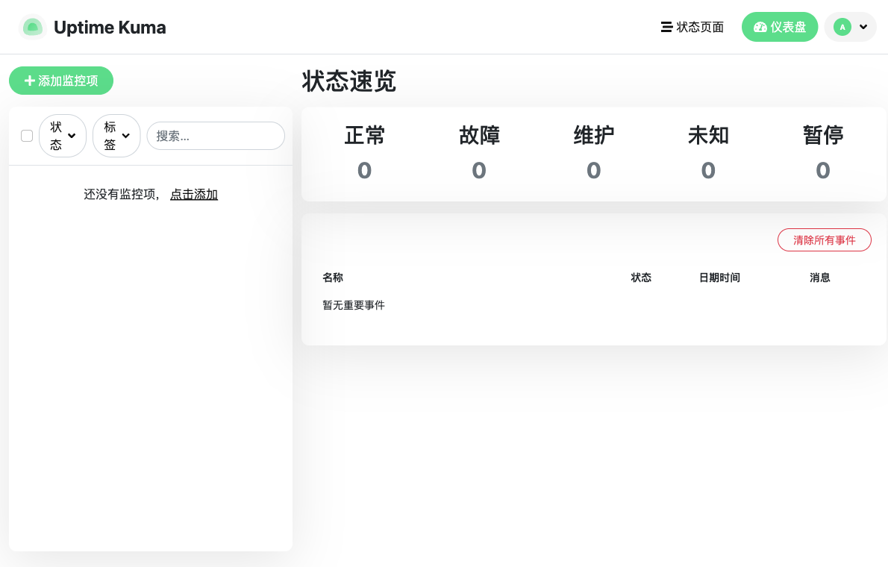
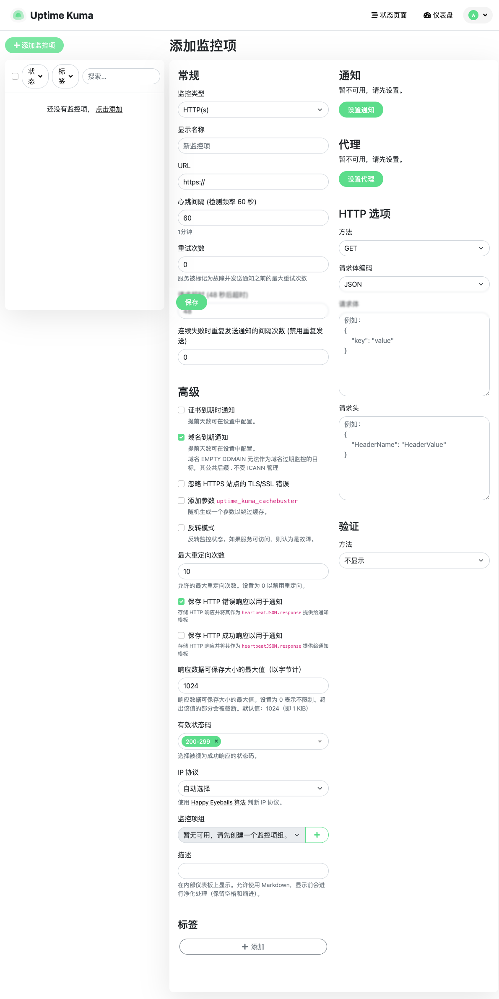
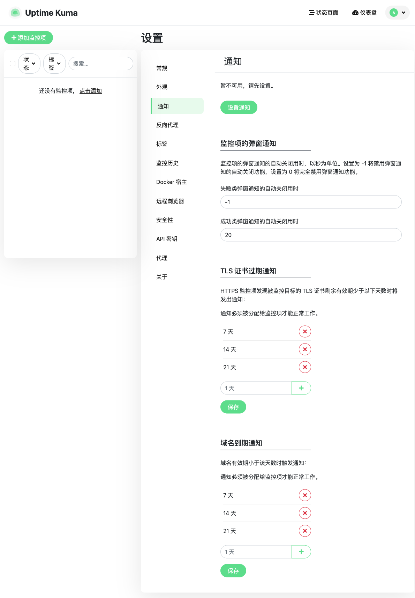
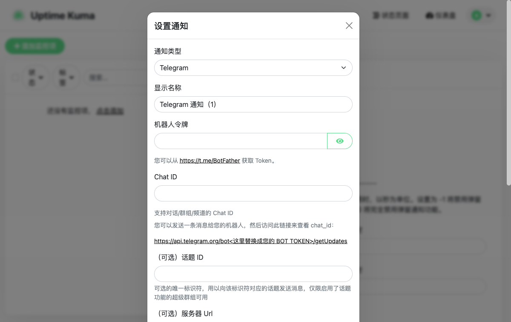
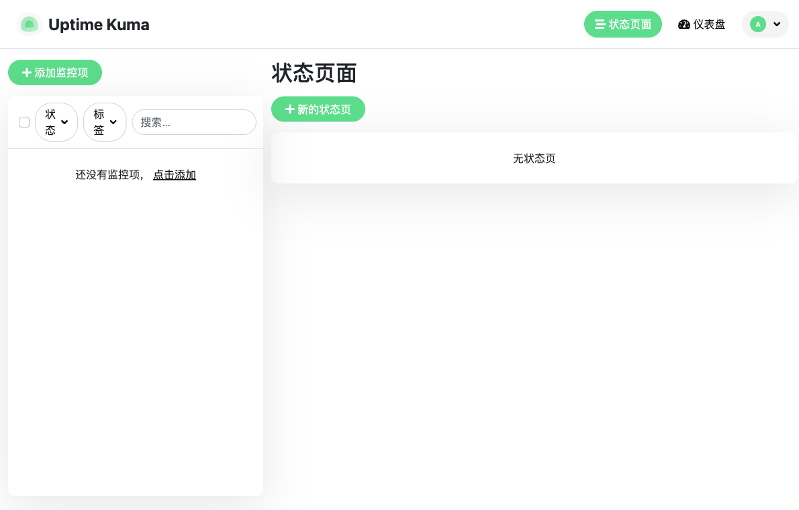
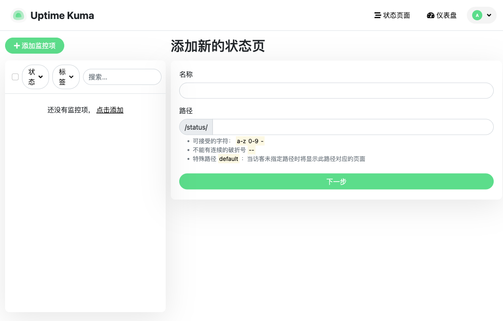
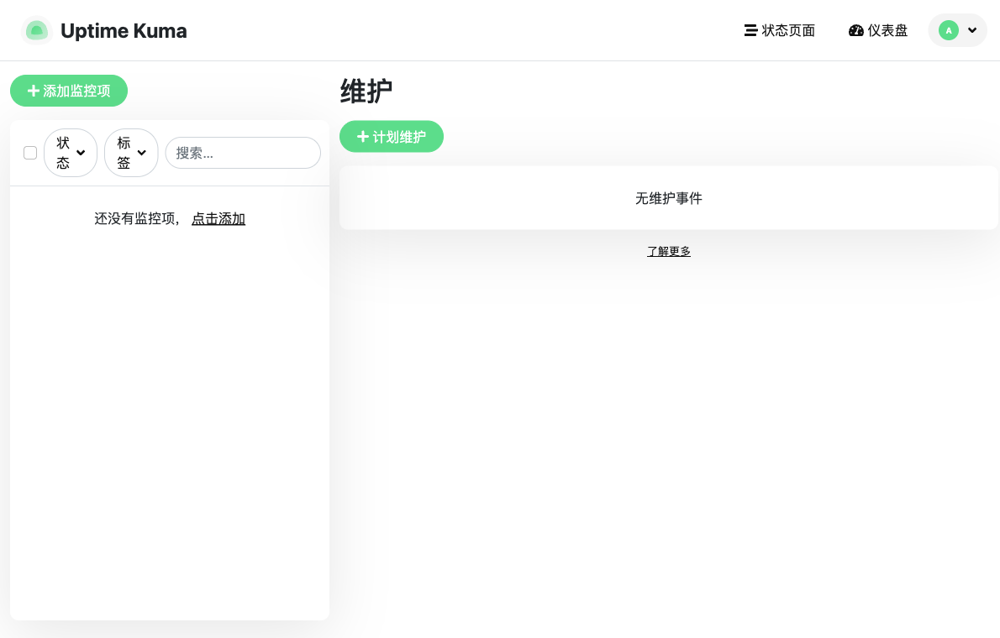
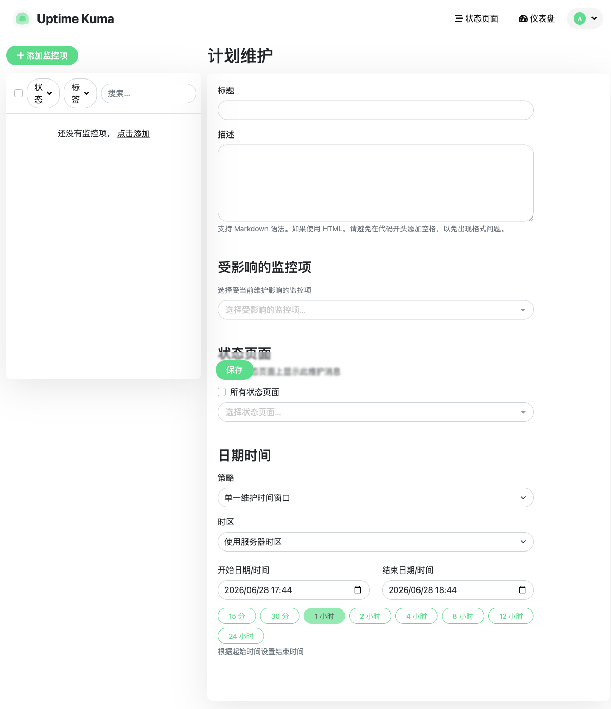
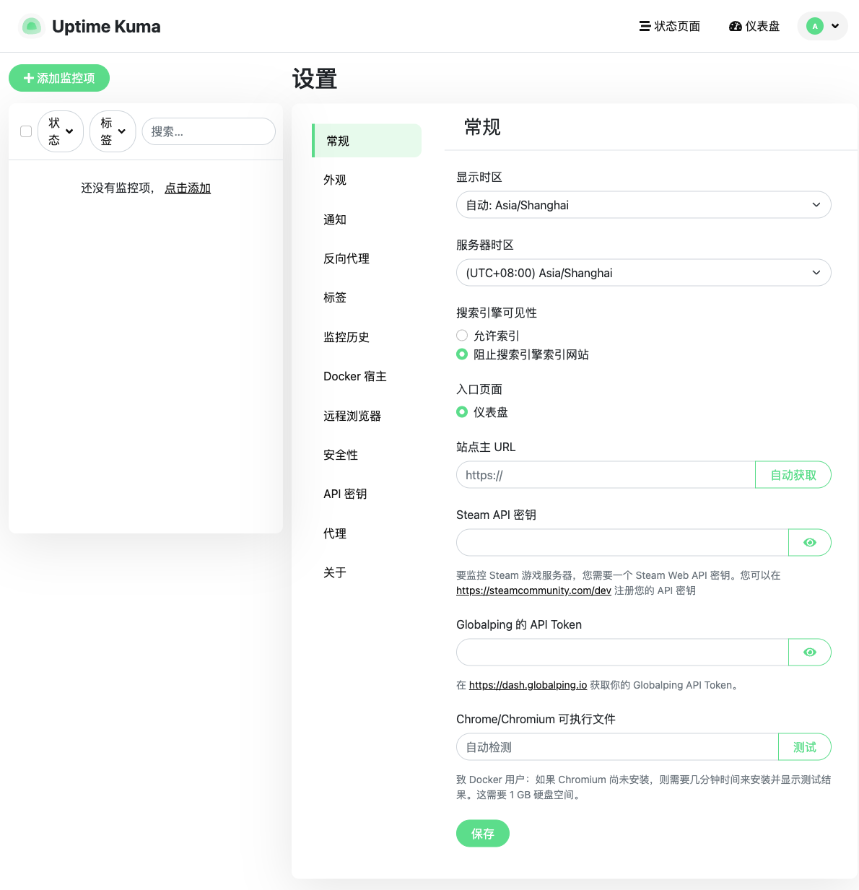
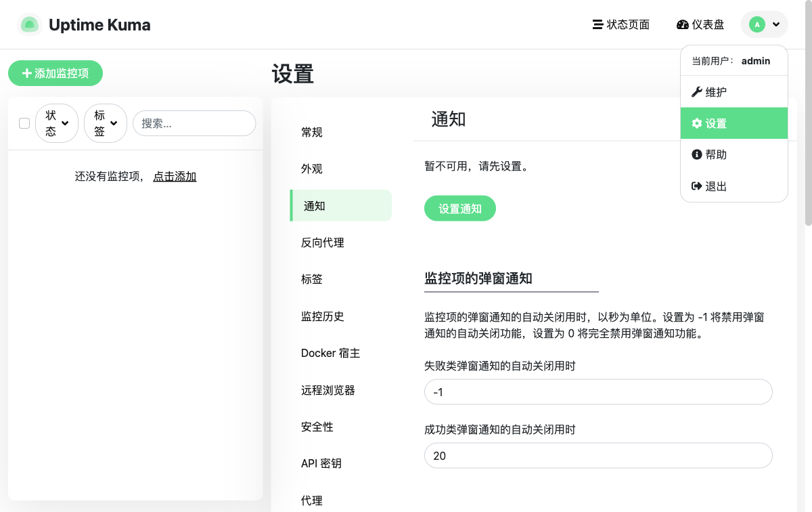

# Uptime Kuma 现有交互流程记录

> 通过浏览器实地访问运行中的实例，记录主要页面的功能区域与交互元素，作为后续设计 / 改版的现状基线。

## 采集环境

| 项目 | 值 |
| --- | --- |
| 访问地址 | `http://localhost:3001` |
| 登录账号 | `admin` / `admin123` |
| 界面语言 | 简体中文（zh-CN） |
| 采集方式 | Playwright 浏览器自动化（页面截图 + 可访问性树快照） |
| 数据状态 | 全新实例，暂无监控项 / 状态页 / 维护事件 |

截图位于 `docs/screenshots/` 目录。

---

## 全局布局（所有页面共用）

每个已登录页面都包含两个固定区域：

**顶部导航栏（banner）**

- `Uptime Kuma` Logo —— 链接回 `/dashboard`
- `状态页面` —— `/manage-status-page`
- `仪表盘` —— `/dashboard`
- 右侧用户头像 `A` —— 点击展开用户下拉菜单（见文末「用户菜单」）

**左侧监控项面板（main 区左栏）**

- `添加监控项` 按钮 —— `/add`
- `搜索监控中站点` 输入框（占位符「搜索…」）
- `全选` 复选框
- `状态` 筛选下拉按钮
- `标签` 筛选下拉按钮
- 监控项列表（空实例显示「还没有监控项，点击添加」）

---

## 1. 仪表盘 Dashboard

- **路由**：`/dashboard`
- **截图**：`./screenshots/01-dashboard.png`

**功能区域**

- 「状态速览」统计卡片区
- 重要事件列表区

**交互元素**

| 元素 | 类型 | 说明 |
| --- | --- | --- |
| 正常 / 故障 / 维护 / 未知 / 暂停 | 统计卡片 | 各状态监控项计数（当前均为 0） |
| 清除所有事件 | 按钮 | 清空重要事件表 |
| 重要事件表 | 表格 | 列：名称、状态、日期时间、消息（空实例显示「暂无重要事件」） |

---

## 2. 添加监控项 Add Monitor

- **路由**：`/add`
- **截图**：`./screenshots/02-add-monitor.png`

**功能区域**：常规、高级、通知、代理、HTTP 选项、验证。

**交互元素（关键）**

| 元素 | 类型 | 说明 |
| --- | --- | --- |
| 监控类型 | 下拉选择 | 共 30 种类型：HTTP(s)、HTTP(s)-关键字、TCP Port、Ping、DNS、Docker 容器、HTTP(s)-Browser Engine (Beta)、分组、Push、手动、Globalping、gRPC(s)-关键字、HTTP(s)-JSON 查询、Kafka Producer、MQTT、RabbitMQ、SIP Options Ping、SMTP、SNMP、Tailscale Ping、Websocket Upgrade、MSSQL、MongoDB、MySQL/MariaDB、Oracle、PostgreSQL、Radius、Redis、GameDig、Steam 游戏服务器 |
| 显示名称 | 文本框 | 占位「新监控项」 |
| URL | 文本框 | 默认 `https://` |
| 心跳间隔 | 数字框 | 默认 60 秒 |
| 重试次数 | 数字框 | 默认 0 |
| 请求超时 | 数字框 | 默认 48 秒 |
| 重发通知间隔 | 数字框 | 默认 0（禁用） |
| 证书到期时通知 / 域名到期通知 | 复选框 | 高级区 |
| 忽略 TLS/SSL 错误 / 缓存绕过参数 / 反转模式 | 复选框 | 高级区 |
| 最大重定向次数 | 数字框 | 默认 10 |
| 保存 HTTP 错误 / 成功响应 | 复选框 | 用于通知模板 |
| 有效状态码 | 多选标签框 | 默认 200-299 |
| IP 协议 | 下拉选择 | 自动选择 / IPv4 / IPv6 |
| 监控项组 | 下拉选择 | 需先创建分组 |
| 描述 | 文本框 | 支持 Markdown |
| 标签 | 区块 + `添加` 按钮 | |
| 设置通知 / 设置代理 | 按钮 | 跳转到对应设置 |
| 方法 / 请求体编码 / 请求体 / 请求头 | HTTP 选项 | GET~OPTIONS；JSON / x-www-form-urlencoded / XML |
| 验证方法 | 下拉选择 | 不显示 / HTTP 基础 / Bearer Token / OAuth2 客户端凭据 / NTLM / mTLS |
| 保存 | 按钮 | 提交监控项 |

---

## 3. 通知设置 Notifications

- **路由**：`/settings/notifications`
- **截图**：`./screenshots/03-notifications.png`、`./screenshots/03b-notification-dialog.png`

**功能区域**

- 全局通知渠道（设置通知）
- 监控项弹窗通知超时设置
- TLS 证书过期通知阈值
- 域名到期通知阈值

**交互元素**

| 元素 | 类型 | 说明 |
| --- | --- | --- |
| 设置通知 | 按钮 | 打开通知渠道配置弹窗 |
| 失败 / 成功类弹窗自动关闭用时 | 数字框 | 默认 -1 / 20 秒 |
| TLS 证书过期天数 | 标签 + 增删 | 默认 7 / 14 / 21 天，可增删 |
| 域名到期天数 | 标签 + 增删 | 默认 7 / 14 / 21 天，可增删 |
| 保存 | 按钮 | 各区块独立保存 |

**通知渠道配置弹窗**（点击「设置通知」）

- `通知类型` 下拉：约 90+ 渠道（Apprise、Webhook、Discord、Slack、Telegram、Email/SMTP、Microsoft Teams、PagerDuty、钉钉、飞书、企业微信、Server酱 等）。
- 选定渠道后展示对应字段（如 Telegram：机器人令牌、Chat ID、话题 ID、服务器 URL，及自定义模板 / 静默发送 / 阻止转发等开关）。
- 底部：`默认开启`、`应用到所有现有监控项` 复选框，`测试`、`保存`、`关闭` 按钮。

---

## 4. 状态页 Status Page

- **路由**：`/manage-status-page`（列表）、`/add-status-page`（新建）
- **截图**：`./screenshots/04-status-page.png`、`./screenshots/04b-add-status-page.png`

**列表页交互元素**

| 元素 | 类型 | 说明 |
| --- | --- | --- |
| 新的状态页 | 链接按钮 | 跳转 `/add-status-page` |
| 状态页列表 | 列表 | 空实例显示「无状态页」 |

**新建状态页表单**

| 元素 | 类型 | 说明 |
| --- | --- | --- |
| 名称 | 文本框 | 状态页名称 |
| 路径 | 文本框 | 前缀 `/status/`，仅允许 `a-z 0-9 -`，不可连续破折号；`default` 为默认页 |
| 下一步 | 按钮 | 创建并进入编辑器 |

---

## 5. 维护计划 Maintenance

- **路由**：`/maintenance`（列表）、`/add-maintenance`（新建）
- **截图**：`./screenshots/05-maintenance.png`、`./screenshots/05b-add-maintenance.png`

**列表页交互元素**

| 元素 | 类型 | 说明 |
| --- | --- | --- |
| 计划维护 | 链接按钮 | 跳转 `/add-maintenance` |
| 维护列表 | 列表 | 空实例显示「无维护事件」 |
| 了解更多 | 外链 | 维护功能 Wiki |

**新建维护表单**

| 元素 | 类型 | 说明 |
| --- | --- | --- |
| 标题 | 文本框 | 必填 |
| 描述 | 文本框 | 支持 Markdown |
| 受影响的监控项 | 多选下拉 | 选择被维护影响的监控项 |
| 状态页面 | 复选框 + 多选下拉 | 「所有状态页面」或指定状态页展示维护信息 |
| 策略 | 下拉选择 | 手动启用/禁用、单一维护时间窗口、Cron 表达式、重复-时间间隔、重复-每周计划、重复-每月计划 |
| 时区 | 下拉选择 | 默认「使用服务器时区」 |
| 开始 / 结束日期时间 | 日期时间框 | |
| 时长快捷按钮 | 按钮组 | 15 分 / 30 分 / 1 小时 / 2 / 4 / 8 / 12 / 24 小时（按起始时间设结束时间） |
| 保存 | 按钮 | 提交维护计划 |

---

## 6. 系统设置 Settings

- **路由**：`/settings/general`（设置默认子页）
- **截图**：`./screenshots/06-settings-general.png`

**设置左侧子导航（共 13 项）**

| 子页 | 路由 |
| --- | --- |
| 常规 | `/settings/general` |
| 外观 | `/settings/appearance` |
| 通知 | `/settings/notifications` |
| 反向代理 | `/settings/reverse-proxy` |
| 标签 | `/settings/tags` |
| 监控历史 | `/settings/monitor-history` |
| Docker 宿主 | `/settings/docker-hosts` |
| 远程浏览器 | `/settings/remote-browsers` |
| 安全性 | `/settings/security` |
| API 密钥 | `/settings/api-keys` |
| 代理 | `/settings/proxies` |
| 关于 | `/settings/about` |

**「常规」子页交互元素**

| 元素 | 类型 | 说明 |
| --- | --- | --- |
| 显示时区 | 下拉选择 | 默认「自动: Asia/Shanghai」 |
| 服务器时区 | 下拉选择 | 当前 Asia/Shanghai |
| 搜索引擎可见性 | 单选 | 允许索引 / 阻止索引（默认阻止） |
| 入口页面 | 单选 | 默认「仪表盘」 |
| 站点主 URL | 文本框 + `自动获取` 按钮 | |
| Steam API 密钥 | 文本框（可见性切换） | |
| Globalping API Token | 文本框（可见性切换） | |
| Chrome/Chromium 可执行文件 | 文本框 + `测试` 按钮 | 用于浏览器引擎监控 |
| 保存 | 按钮 | 保存常规设置 |

---

## 用户菜单（顶部头像下拉）

- **截图**：`./screenshots/07-user-menu.png`

| 元素 | 类型 | 说明 |
| --- | --- | --- |
| 当前用户：admin | 文本 | 显示当前登录用户 |
| 维护 | 链接 | `/maintenance` |
| 设置 | 链接 | `/settings/general` |
| 帮助 | 外链 | 项目 Wiki |
| 退出 | 按钮 | 退出登录 |

---

## 截图清单

| 文件 | 对应页面 |
| --- | --- |
| `01-dashboard.png` | 仪表盘 |
| `02-add-monitor.png` | 添加监控项 |
| `03-notifications.png` | 通知设置 |
| `03b-notification-dialog.png` | 通知渠道配置弹窗 |
| `04-status-page.png` | 状态页列表 |
| `04b-add-status-page.png` | 新建状态页表单 |
| `05-maintenance.png` | 维护计划列表 |
| `05b-add-maintenance.png` | 新建维护表单 |
| `06-settings-general.png` | 系统设置（常规） |
| `07-user-menu.png` | 用户菜单 |
